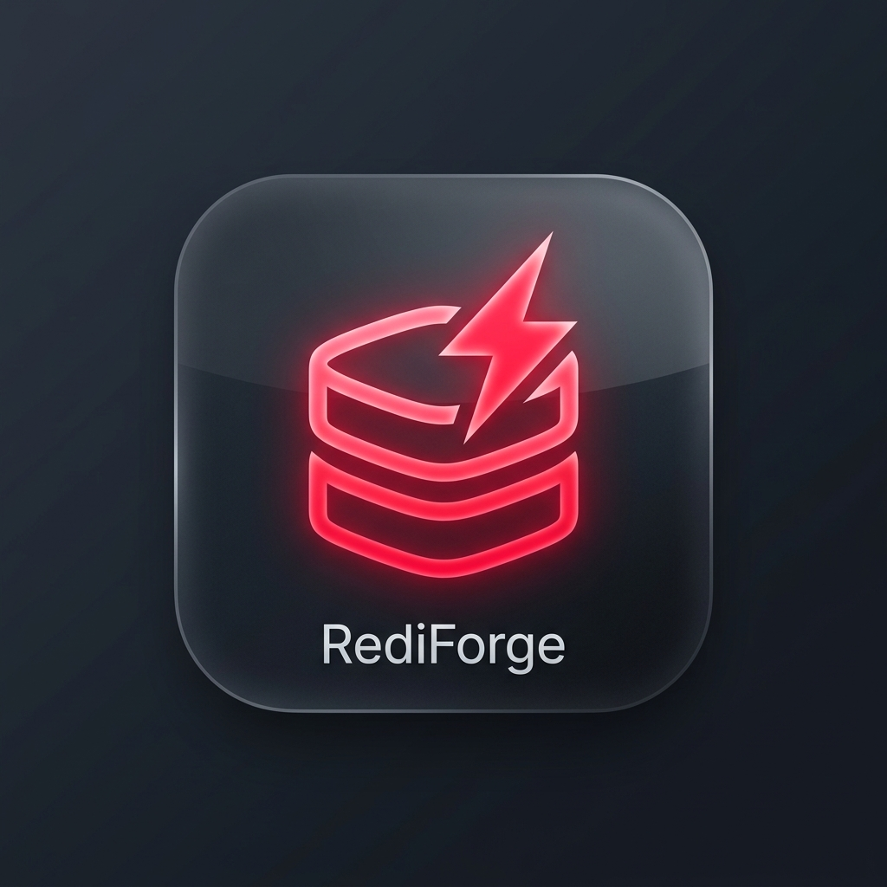

# RediForge Desktop Admin

<p align="center">
  
</p>

<p align="center">
  <b>A native, high-performance desktop administration client for RediForge</b><br/>
  Built with Electron 33, React 18, TypeScript 5, and a custom zero-dependency RESP2 protocol engine.
</p>

---

## Overview

**RediForge Desktop Admin** is a dedicated desktop application engineered to provide database operators and developers with an intuitive visual interface for monitoring, querying, and managing RediForge and Redis-compatible data stores.

Unlike traditional web-based admin tools that require an intermediate HTTP or WebSocket bridge, RediForge Desktop connects **directly over raw TCP sockets** using an internal TypeScript implementation of the **RESP2 wire protocol**.

---

## Architectural Highlights

```
┌───────────────────────────────────────────────────────────┐
│              Electron Renderer Process (React)            │
│  ┌─────────────┐ ┌─────────────┐ ┌──────────────────────┐ │
│  │ Key Browser │ │ Live Console│ │  Metrics Dashboard   │ │
│  └──────┬──────┘ └──────┬──────┘ └──────────┬───────────┘ │
│         │               │                   │             │
│  ┌──────┴───────────────┴───────────────────┴───────────┐ │
│  │     IPC Invocation Layer (window.api via Preload)    │ │
│  └──────────────────────────────┬───────────────────────┘ │
└─────────────────────────────────┼─────────────────────────┘
                                  │ contextBridge (IPC)
┌─────────────────────────────────┼─────────────────────────┐
│               Electron Main Process (Node.js)             │
│  ┌──────────────────────────────▼───────────────────────┐ │
│  │       IPC Dispatcher & Connection Manager            │ │
│  │   - Encrypted Profile Storage (Electron SafeStorage) │ │
│  │   - Window State Persistence (electron-store)        │ │
│  └──────────────────────────────┬───────────────────────┘ │
│                                 │                         │
│  ┌──────────────────────────────▼───────────────────────┐ │
│  │          Custom RESP2 TCP Socket Client              │ │
│  │   - Streaming Buffer Parser                          │ │
│  │   - Bulk String / Array Serializer                   │ │
│  │   - Auto-reconnect & Pipelined Queue                 │ │
│  └──────────────────────────────┬───────────────────────┘ │
└─────────────────────────────────┼─────────────────────────┘
                                  │ Raw TCP (Port 6379)
                                  ▼
                    ┌───────────────────────────┐
                    │     RediForge Server      │
                    │   (In-Memory RESP2 Data)  │
                    └───────────────────────────┘
```

### 1. Process Model & Hardened Security
- **Context Isolation Enabled**: `contextIsolation: true` prevents prototype pollution and keeps the renderer sandbox strictly separated from Node.js internals.
- **Node Integration Disabled**: `nodeIntegration: false` ensures the renderer cannot directly access the local filesystem or native APIs.
- **Strict IPC Barrier**: All communication flows across a typed, audited `contextBridge` boundary (`window.api`).
- **Encrypted Password Storage**: Connection profiles with passwords are encrypted at rest using Electron's native `safeStorage` API (Windows DPAPI / macOS Keychain).

### 2. Custom Zero-Dependency RESP2 TCP Client
- Built from scratch in TypeScript without third-party Redis client dependencies.
- Handles RESP2 protocol primitives: Simple Strings (`+`), Errors (`-`), Integers (`:`), Bulk Strings (`$`), and Arrays (`*`).
- Supports chunked packet streaming, automatic backpressure handling, and request-response pipeline queuing.

---

## Core Feature Modules

### 1. Key Browser & Editor
- **SCAN-Based Pagination**: Efficiently browses millions of keys using cursor-based `SCAN` without blocking the server.
- **Type Inspection**: Automatically detects and visually badges all 5 Redis data structures:
  - [String] **Strings**: Raw and formatted payload viewer and inline editor.
  - [List] **Lists**: Ordered sequence table (`LRANGE`, `LPUSH`, `RPUSH`, `LLEN`).
  - [Hash] **Hashes**: Key-value field inspector with inline field editing and deletion (`HGETALL`, `HSET`, `HDEL`).
  - [Set] **Sets**: Member list manager with addition and removal (`SMEMBERS`, `SADD`, `SREM`).
  - [ZSet] **Sorted Sets**: Scored leaderboard table with score updates (`ZRANGE`, `ZADD`, `ZREM`).
- **Key Operations**: Live TTL inspection, setting/clearing expiration (`EXPIRE`, `PERSIST`), renaming (`RENAME`), and deletion (`DEL`).

### 2. Command Console (REPL)
- Interactive CLI with syntax highlighting.
- Autocomplete drawer covering 93 registered commands.
- Command history navigation (Up/Down arrow keys).
- **Safe Mode**: Guardrail toggle that flags and blocks mutating commands (`FLUSHALL`, `FLUSHDB`, `DEL`, etc.) in production environments.

### 3. Real-Time Metrics & Health Dashboard
- Periodic `INFO` telemetry aggregation (Server, Clients, Memory, Keyspace).
- Canvas-based live memory utilization time-series graph.
- Multi-database keyspace distribution bar chart.
- Per-database quick switcher (`SELECT` 0–15).

### 4. Persistence & Configuration Manager
- Real-time RDB snapshot status (`BGSAVE`) and AOF persistence state.
- Trigger manual point-in-time snapshots with one click.
- Runtime configuration viewer and editor (`CONFIG GET` / `CONFIG SET`).

### 5. Pub/Sub Monitor
- Multi-channel subscriber with live streaming event feed.
- Built-in message publisher to broadcast payloads across active channels.

### 6. Transaction Staging Area
- Visual `MULTI` / `EXEC` / `DISCARD` builder.
- Stage sequential commands, preview queue order, and inspect atomic execution results.
- `WATCH` key selector to guard against concurrent modifications.

---

## Project Structure

```
desktop/
├── assets/                       # App icons (PNG, ICO)
├── src/
│   ├── main/                     # Electron Main Process
│   │   ├── main.ts               # App entry & window management
│   │   ├── preload.ts            # contextBridge typed API
│   │   ├── connection-manager.ts # Multi-connection coordinator
│   │   ├── store.ts              # Encrypted settings & window state
│   │   ├── resp2/                # Custom RESP2 TCP Engine
│   │   │   ├── client.ts         # TCP Socket client & request queue
│   │   │   ├── parser.ts         # Streaming RESP2 protocol parser
│   │   │   └── encoder.ts        # Command array serializer
│   │   └── ipc/                  # Domain-specific IPC handlers
│   │       ├── connection.ts     # Connect, disconnect, profiles
│   │       ├── keys.ts           # SCAN, TYPE, TTL, RENAME, DEL
│   │       ├── data.ts           # Data structure read/write
│   │       ├── console.ts        # Freeform command execution
│   │       ├── metrics.ts        # Telemetry polling
│   │       ├── persistence.ts    # Snapshots & configs
│   │       ├── pubsub.ts         # Message streaming
│   │       └── transaction.ts    # MULTI/EXEC staging
│   └── renderer/                 # React Renderer (UI Chrome)
│       ├── main.tsx              # React entry point
│       ├── App.tsx               # Root view router & shell
│       ├── styles/               # Glassmorphism dark-first styles
│       ├── types/ipc.ts          # End-to-end TypeScript interfaces
│       └── components/           # Component library
│           ├── layout/           # Frameless TitleBar, Sidebar, StatusBar
│           ├── connection/       # Profile management & Quick Connect
│           ├── browser/          # Type-aware key browser
│           ├── console/          # Interactive REPL
│           ├── dashboard/        # Live metrics & graphs
│           ├── persistence/      # Snapshot & config panel
│           ├── pubsub/           # Message feed
│           └── transactions/     # Transaction builder
└── tests/
    ├── resp2.test.js             # Protocol encoder & parser unit tests
    └── e2e.test.js               # Full TCP integration tests against RediForge
```

---

## Getting Started

### Prerequisites
- Node.js 18+ (tested on Node.js 22 LTS)
- npm 9+

### Installation & Setup

```bash
# Navigate to the desktop client directory
cd desktop

# Install dependencies
npm install

# Run automated unit and integration tests
npm test

# Typecheck TypeScript across both main and renderer processes
npm run typecheck

# Launch the development environment (concurrently runs Vite + Electron)
npm run dev
```

### Production Build & Packaging

```bash
# Compile TypeScript and Vite production bundle
npm run build

# Package unpacked application directory (release/win-unpacked/)
npm run pack

# Generate Windows installer (.exe)
npm run dist
```

---

## License
MIT © Ashutosh Yadav
